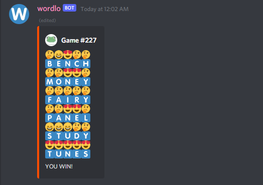

# Wordlo - a Wordle clone for Discord

Wordlo is a clone of the puzzle game [Wordle](https://www.powerlanguage.co.uk/wordle/).

## Commands:
`!wordlo` - Start a singleplayer game.

`!wordlo @otheruser @otherotheruser` - Start a co-op game.

`!<word>` - Guess a word in an active game. e.g., `&horse`.

`!quit` - Abort an active game.

`!help` - Display this help message.

## How to Play
You have 6 tries to discover the secret word. Each guess must be a 5 letter
English word. The emojis that appear above your guess will give you hints about
the secret word:

🤔 - The letter below is not in the secret word.

😄 - The letter below is in the secret word, but in a different position.

😍 - The letter below in the same position in the secret word.

Guess the secret word within 6 tries to win!
